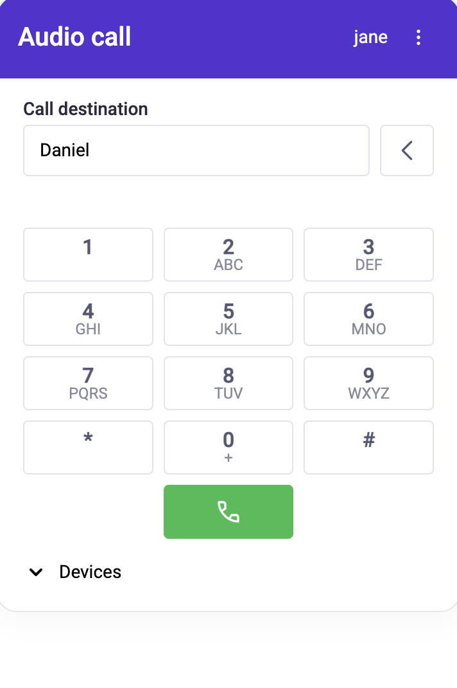
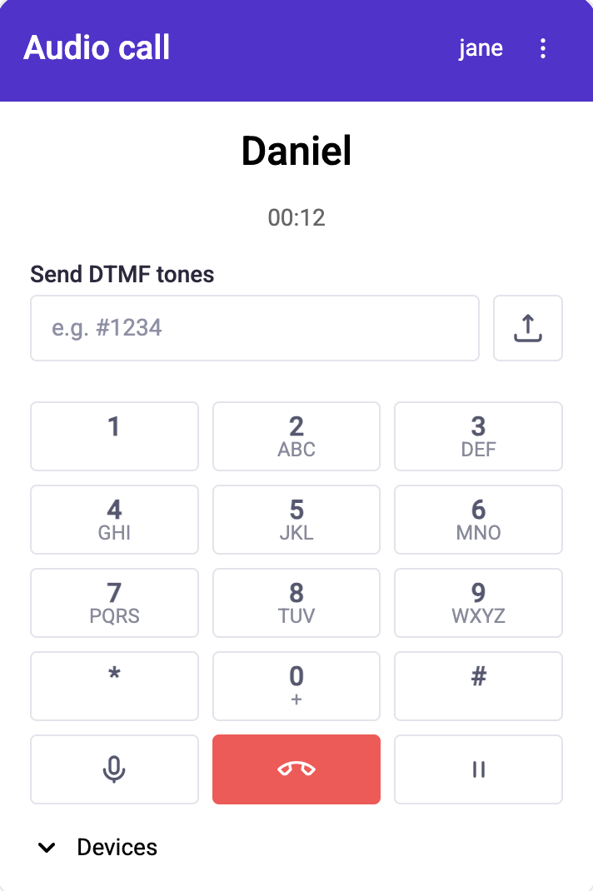
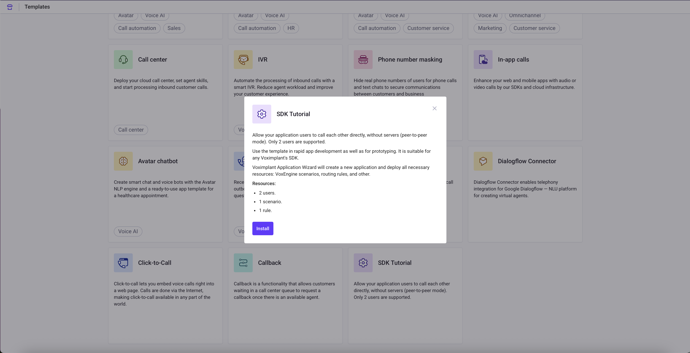

# Voximplant audio call demo for Vue.js

A ready-to-use audio call application built with Vue.js 3 and Voximplant Web SDK 5.x. This demo shows how to integrate voice calling capabilities into a Vue-based application. 

## Contents

- [Features](#features)
- [Quick start](#quick-start)
- [Voximplant setup](#voximplant-setup)
- [Architecture](#architecture)
- [Troubleshooting](#troubleshooting)

## Features

The demo application provides the following features:

- **Audio calls** to Voximplant users, SIP URIs, and phone numbers
- **User authentication** with the Voximplant credentials
- **Device selection** for audio input and output
- **Call controls** including mute, hold, and hangup
- **DTMF input** for interactive voice response systems
- **Incoming call management** with accept/decline functionality
- **Call duration tracking** with real-time display
- **Multiple device support** with audio device switching

 

## Quick start

### Prerequisites

- [Node.js](https://nodejs.org) v20.19.0 or v22.12.0+
- [Yarn](https://yarnpkg.com) package manager
- Voximplant account with an application and user credentials

### Installation

1. Clone the repository and navigate to the demo directory:
    ```sh
    cd examples/demo-audio-call
    ```
2. Install dependencies:
    ```sh
    yarn install
    ```
3. Start the development server:
    ```sh
    yarn dev
    ```

The application will be available at `http://localhost:5173`

## Voximplant setup

To get started, you need to [register](https://manage.voximplant.com/auth/sign_up) a free Voximplant developer account.

You need the following:
- Voximplant application
- Two Voximplant users
- VoxEngine scenario
- Routing setup

### Automatic

We've implemented a special template to enable you to quickly use the demo – just install [SDK tutorial](https://manage.voximplant.com/marketplace) from our marketplace:



### Manual

1. Create a new [application](https://voximplant.com/docs/gettingstarted/basicconcepts/applications)
2. Create a [user](https://voximplant.com/docs/gettingstarted/basicconcepts/users) to log in to the application (or use an existing one)
3. Create a [scenario](https://voximplant.com/docs/gettingstarted/basicconcepts/scenarios) to process the call logic
4. Set up a routing [rule](https://voximplant.com/docs/getting-started/basic-concepts/routing-rules)

#### VoxEngine scenario example

```typescript
VoxEngine.addEventListener(AppEvents.CallAlerting, (e) => {
   const newCall = VoxEngine.callUserDirect(
     e.call,
     e.destination,
     {
        displayName: e.displayName,
        callerid: e.callerid,
        headers: e.headers,
     }
   );
   VoxEngine.easyProcess(e.call, newCall, ()=>{}, true);
});
```

## Architecture

### Project structure

```
src/
├── components/          # Reusable UI components
├── composables/         # Reusable composition functions
├── layout/              # Layout components
├── router/              # Vue Router configuration
├── service/             
│   └── websdk/          # Voximplant websdk logic layer
├── store/               # Application state management
├── utils/               # Helper functions
├── views/               # Page components
│   ├── Call.vue               # Active call page
│   ├── Main.vue               # Dialer page
│   └── SignIn.vue             # Login page
├── App.vue              # Root component
└── main.ts              # Application entry point
```

### Key components

#### Sign in view

- User authentication form
- Node selection
- Credential validation
- Web SDK connection initialization

#### Main view (Dialer)

- Call destination input
- Numpad for dialing
- Audio device selection
- Call initiation

#### Call view

- Active call display
- Call controls (mute, hold, hangup)
- Call duration
- DTMF input
- Call status indicators

### State management

The application uses Vue 3's reactive refs for the state management:
- **User store** — Authentication credentials and user info
- **Call store** — Active call state and destination
- **Incoming calls store** — Queue of incoming calls

### Composables

Reusable composition functions provide:
- **useCallDuration** — Call timer logic
- **useWatchable** — Web SDK state reactivity
- **useLongPress** — Touch interaction

#### Persistent settings

User credentials are stored in localStorage via the `persistRef` utility:

```typescript
// src/store/user.ts
export const username = persistRef('vox-demo-username', '');
export const password = persistRef('vox-demo-password', '');
```


See the [WebSDK documentation](https://voximplant.com/docs/references/websdk-v5) for complete event reference.

## Troubleshooting

**Cannot connect to Voximplant**

- Check your Internet connection
- Verify the node selection
- Ensure your firewall allows WebRTC connections

**Login fails**

- Verify the username format: `user@app.account.voximplant.com`
- Check the password is correct
- Ensure that the user exists in the Voximplant application

**No audio during call**

- Grant the microphone permission
- Check the selected audio device

**Call fails immediately**

- Check that the VoxEngine scenario is attached to the application rule
- Verify the destination format (user, phone number, or SIP address)
- Review the scenario logs in the Voximplant Control Panel

## Resources

- [Voximplant Documentation](https://voximplant.com/docs)
- [Web SDK v5 Reference](https://voximplant.com/docs/references/websdk-v5)
- [Vue.js Documentation](https://vuejs.org)
- [SpaceUI Components](https://www.npmjs.com/package/@voximplant/spaceui)
